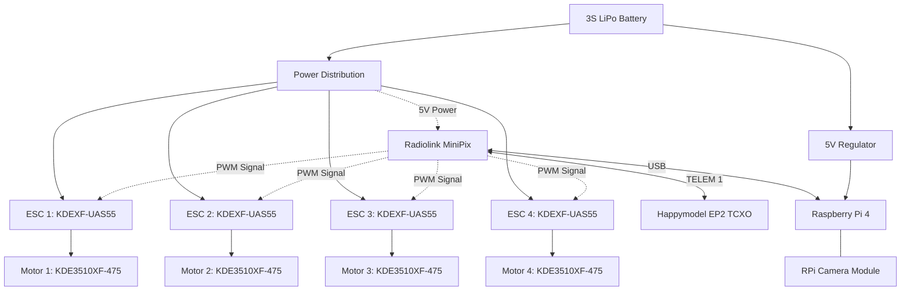

# Hardware Assembly & Components

This document outlines the physical build and electrical components of the drone.

The initial concept was based on a Parallax ELEV-8 kit. However, because the original chassis, flight controller, and motor mounts were missing, we custom-engineered replacement parts and upgraded the core electronics to support our specific payload and requirements.

!!! note "Prototyping Status"
As this is an active experimental build, several components are currently secured using zip ties and tape. This allows for rapid and easy component swapping.

---

## 1. Frame and Chassis Assembly

To replace the missing Parallax parts, we modeled a custom multi-level chassis in SolidWorks and manufactured it using laser cutting. The design uses spacers to separate the levels and distribute the hardware:

- **Main Body Stack:** Consists of three identical, laser-cut chassis plates stacked on top of each other using standoffs. These lower plates house the heavy power distribution wiring and the ESCs.
- **Battery Placement:** The 3S LiPo battery is strapped directly to the outer bottom face of the lowest chassis plate.
- **Avionics Plate:** A smaller, dedicated chassis plate is mounted on the very top of the stack. This isolates the flight controller from the main power lines.

---

## 2. Motors, ESCs, and Propellers

Because we are adding a companion computer, we needed more lifting capacity than a standard ELEV-8. We sourced heavy-duty hardware from KDE Direct.

- **Motors:** 4x KDE3510XF-475 (Brushless)
- **ESCs:** 4x KDEXF-UAS55
- **Propellers:** KDE-CF155-DP-M4 (15.5-inch folding carbon fiber blades)

---

## 3. Flight Controller & Avionics

The original Parallax control board was replaced with a system capable of running ArduPilot, allowing us to send MAVLink commands from a companion computer.

- **Flight Controller:** Radiolink MiniPix (Mounted on the top avionics plate).
- **Receiver:** Happymodel ELRS 2.4G EP2 TCXO.

!!! info "Custom Receiver Wiring (TELEM 1)"
The Radiolink MiniPix typically expects a standard receiver to be plugged into the `RC IN` port. However, our Happymodel ExpressLRS receiver uses a serial protocol.
Instead of using `RC IN`, we bypassed it and wired the receiver directly to the **TELEM1 serial port**. This allows us to transmit both the pilot's control inputs and receive full MAVLink telemetry back to the controller over a single connection.

## 4. Companion Computer

To run the ROS 2 software stack, we are integrating an onboard computer.

- **Hardware:** Raspberry Pi 4.
- **Vision:** Standard Raspberry Pi Camera module.
- **Connection:** The RPi 4 connects directly to the MiniPix flight controller via USB to send and receive MAVLink commands. Physical mounting for these components is currently being finalized.

## 5. Mechanical Assets & Manufacturing

The physical drone was manufactured using the specific 2D laser-cutting profiles below.

- **[Download Main Chassis Plate (.dxf)](assets/CAD/Chassis.DXF)** - Profile used for the three main stacked body plates.
- **[Download Controller Plate (.dxf)](assets/CAD/ControllerBase.DXF)** - Profile used for the smaller top plate holding the flight controller.
